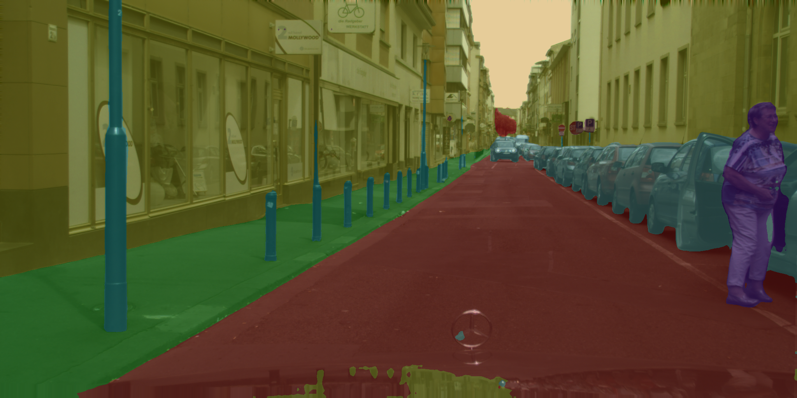
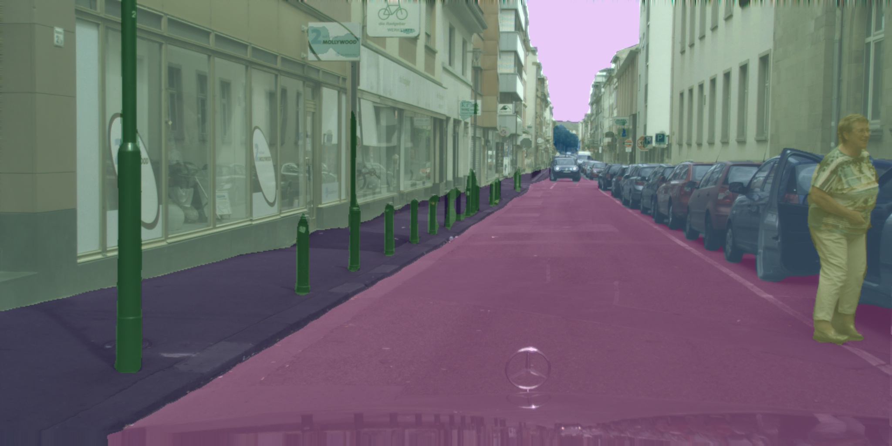

# PPLiteSeg.pytorch
pytorch of the SOTA real-time segmentation network ppliteseg

| Model        | Backbone | Training Iters | Train Resolution | Test Resolution | mIoU   | mIoU (flip) | mIoU (ms+flip) |
| ------------ | -------- | -------------- | ---------------- | --------------- | ------ | ----------- | -------------- |
| PP-LiteSeg-T | STDC1    | 160000         | 1024x512         | 1025x512        | 73.10% | 73.89%      | -              |
| PP-LiteSeg-T | STDC1    | 160000         | 1024x512         | 1536x768        | 76.03% | 76.74%      | -              |
| PP-LiteSeg-T | STDC1    | 160000         | 1024x512         | 2048x1024       | 77.04% | 77.73%      | 77.46%         |
| PP-LiteSeg-B | STDC2    | 160000         | 1024x512         | 1024x512        | 75.25% | 75.65%      | -              |
| PP-LiteSeg-B | STDC2    | 160000         | 1024x512         | 1536x768        | 78.75% | 79.23%      | -              |
| PP-LiteSeg-B | STDC2    | 160000         | 1024x512         | 2048x1024       | 79.04% | 79.52%      | 79.85%         |

here we convert the model and weights of PP-LiteSeg-B(1024x512) from paddlepaddle to torch.

## Model&Weight

pp_liteseg.py : pytorch model

[ppliteset_pp2torch_cityscape_pretrained.pth](https://github.com/midasklr/PPLiteSeg.pytorch/releases/download/weights/ppliteset_pp2torch_cityscape_pretrained.pth): the cityscape pretrained weights trained with paddleseg 

demo of paddleseg:

demo of pytorch:

## Difference

### upsample

PaddleSeg use "bilinear" mode, while in pytorch, I use "nereast" mode in order to convert to TensorRT .

### BatchNorm

paddleseg :momentum=0.9

while the default setting of torch: momentum=0.1.

## train

use [ddrnet](https://github.com/midasklr/DDRNet.Pytorch) to train this model, set the coefficient of three seghead(1/8,1/16and1/32) loss to 1 while training.

## Demo

see demo.py

## reference

1. https://github.com/PaddlePaddle/PaddleSeg/tree/develop/configs/pp_liteseg
